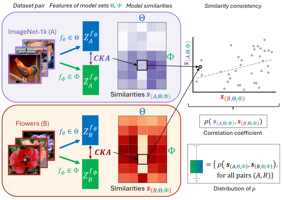

# Representational similarity consistency across datasets

This repository contains the code and experiments for the paper
*"Training objective drives the consistency of representational similarity across
datasets"* ([arXiv](https://arxiv.org/abs/xxxx.xxxxx)).

## Table of Contents

1. [About](#about)
2. [Repository and project overview](#repository-and-project-overview)
3. [How to install?](#how-to-install)
4. [How to run?](#how-to-run)

## About

<p align="center">
  

</p>

[*The Platonic Representation Hypothesis*](https://phillipi.github.io/prh/#what_converging_to) claims that recent 
foundation models are converging to a shared representation space as a function of their downstream task performance, 
irrespective of the objectives and data modalities used to train these models. Representational similarity is generally 
measured for individual datasets and is not necessarily consistent across datasets. Thus, one may wonder whether this 
convergence of model representations is confounded by the datasets commonly used in machine learning. 
Here, we propose a systematic way to measure how representational similarity between models varies with the set of 
stimuli used to construct the representations. We find that the objective function is the most crucial factor in 
determining the consistency of representational similarities across datasets. Specifically, self-supervised vision 
models learn representations whose relative pairwise similarities generalize better from one dataset to another compared 
to those of image classification or image-text models. Moreover, the correspondence between representational 
similarities and the models' task behavior is dataset-dependent, being most strongly pronounced for single-domain 
datasets. Our work provides a framework for systematically measuring similarities of model representations across 
datasets and linking those similarities to differences in task behavior.

## Repository and project overview

### Repository organization

- 🔧 `sim_consistency/`
    - Core library code .
- 📜 `scripts/`
    - `config/`: Configuration files for models and datasets
    - `download_ds/`: Dataset download scripts
    - Scripts for feature extraction, model similarity computation, and linear probe evaluation. (
      See [How to Run](#how-to-run))
- 📓 `notebooks/`
    - Jupyter notebooks for analysis and visualization.
      Each notebook is named according to its corresponding paper section and can be used to reproduce our findings 🧪 .


### Project structure

The code relies on a specific directory structure for data organization.
All paths are configured created in `scripts/project_location.py`.

```plaintext
project_root/
├── datasets/           # Raw and subsetted datasets
├── features/           # Extracted model features
├── model_similarities/ # Representation  similarity matrices for given dataset, set of models and similarity metric
├── models/             # Trained linear probe models
└── results/            # Evaluation results and experiments
```

## How to install?

1. Nagivate to the repository root directory.
2. Install the package: `pip install .`
3. Configure the project location as described in the [Project structure](#project-structure) section.
   You can define the paths in the `scripts/project_location.py` file and run it. It will create the necessary directories.

## How to run?
⚠️ **Disclaimer**: Scripts are designed for SLURM clusters and are computationally expensive. For local reproduction, 
we recommend downloading our intermediate results [here](https://tubcloud.tu-berlin.de/s/iTmTwqnao3fxH2t) (after step **4.1**) and proceeding directly to [step 4.2](#4-how-to-reproduce-our-results).

### 0. Download datasets 💾

- Create the webdatasets directory `[PROJECT_ROOT]/datasets/wds`
- Download the datasets using the script `scripts/download_ds/download_webdatasets.sh`.

```bash 
cd scripts/download_ds
bash download_webdatasets.sh [PROJECT_ROOT]/datasets/wds
```

**NOTE**: Scripts download datasets from `huggingface.co`. A Hugging Face account may be required -
see [download guide](https://huggingface.co/docs/hub/datasets-downloading#using-git).

### 1. Feature Extraction 🔍

Running the script `scripts/feature_extraction.py` will extract features from the models specified in the
`models_config` file for the datasets specified in the `datasets` file. The script launches a SLURM job for each model
separately. It saves the extracted features in `[PROJECT_ROOT]/features` directory.

```bash 
cd scripts
python feature_extraction.py \
       --models_config ./configs/models_config_wo_alignment.json \
       --datasets ./configs/webdatasets_w_in1k.txt
```

### 2. Model Similarities 🔄
The computation of the model similarities is a crucial step in our analysis. It consists of two parts: 
Dataset subsampling and model similarity computation. The first part is necessary to ensure that the datasets have a
maximum of 10k samples (see paper for justification), while the second part computes the representational similarities 
between the models.

#### Dataset subsampling

- **ImageNet-1k**: 
  1. Run:
     ```bash
        cd scripts
        python generate_imagenet_subset_indices.py 
     ```
     It will generate the indices for the ImageNet-1k subset datasets and store them in `[PROJECT_ROOT]/datasets/subset`.
  2. Create the new ImageNet-1k subsets, by slicing the precomputed features:
     ```bash
        cd scripts
        python in_subset_extraction.py
     ```
     It will create the ImageNet-1k subsets and store them in `[PROJECT_ROOT]/datasets/imagenet-subset-{X}k` 
     (`X` indicating the total nr. of samples).
- **Remaining Datasets**: Run the jupyter notebook `notebooks/check_wds_sizes_n_get_subsets.ipynb` to check the dataset sizes and create
    subsets of the datasets if needed. The indices for the subsets are stored in `[PROJECT_ROOT]/datasets/subset`. 


#### Model similarity computation

Running the script `scripts/distance_matrix_computation.py` will compute the representational similarities between the
models for each dataset and similarity metric specified in `scripts/configs/similarity_metric_config_local_global.json`.
It saves the computed similarity matrices in `[PROJECT_ROOT]/model_similarities` directory.

```bash 
cd scripts
python distance_matrix_computation.py \
       --models_config ./configs/models_config_wo_alignment.json \
       --datasets ./configs/webdatasets_w_insub10k.txt
```


### 3. Linear Probing (Single model downstream task evaluation) 📈 

Running the script `scripts/single_model_evaluation.py` will train a linear probe on the extracted features for each
model and dataset specified in the `models_config` and `datasets` files, respectively. 
It saves the trained models in `[PROJECT_ROOT]/models` and the evaluation results in the 
`[PROJECT_ROOT]` directory.

```bash 
cd scripts
python single_model_evaluation.py \
       --models_config ./configs/models_config_wo_alignment.json \
       --datasets ./configs/webdatasets_w_in1k.txt
```
**Note**: The script automatically launches separate SLURM jobs for each model to enable parallel processing.

### 4. How to reproduce our experiments? 🧪 

After having extracted the features, computed the model similarities, and trained the linear probes, you can reproduce
our results by following steps:

1. Run aggregation notebooks:
   - All `notebooks/aggregate_*` notebooks: store the results in `[PROJECT_ROOT]/ results/aggregated/`
   - 🔥 For consistency computation of **specific model set pairs** 🔥: 
     `notebooks/aggregate_consistencies_for_specific_model_set_pairs.ipynb`
2. Run section-specific notebooks to generate figures
   - Results saved in `results/plots/`

## Acknowledgements

- This repository is built using components from [thingsvision](https://github.com/ViCCo-Group/thingsvision) and the [CLIP benchmark](https://github.com/LAION-AI/CLIP_benchmark)

## Citation

If you find this work interesting or useful in your research, please cite our paper:

```bibtex
@article{author2024title,
    title={Paper Title},
    author={Author, First and Second, Author},
    journal={Journal Name},
    year={2024}
}
```

### Thank you

If you have any feedback, questions, or ideas, please feel free to raise an issue in this repository. 
Alternatively, you can reach out to us directly via email for more in-depth discussions or suggestions. 

📧 Contact us: ciernik[at]tu-berlin.de

Thank you for your interest and support!
